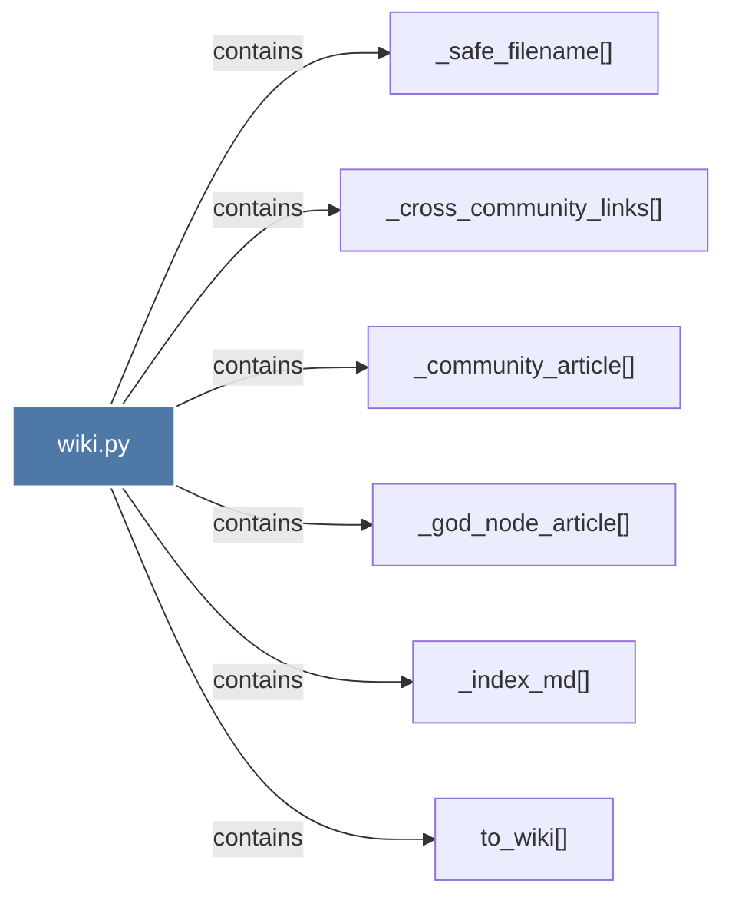

# wiki.py

> [!info] Properties
> **File Type**: code
> **Community**: [[_COMMUNITY_Community None|Community None]]
> **Degree**: 6

## Architecture Graph


## Outbound Connections
- [[_community_article()]] - `contains` [EXTRACTED]
- [[_cross_community_links()]] - `contains` [EXTRACTED]
- [[_god_node_article()]] - `contains` [EXTRACTED]
- [[_index_md()]] - `contains` [EXTRACTED]
- [[_safe_filename()]] - `contains` [EXTRACTED]
- [[to_wiki()]] - `contains` [EXTRACTED]

## Inbound Dependencies
> [!abstract]- Files that link here
```dataview
LIST
FROM [[wiki.py]]
```

#graphify/code #graphify/EXTRACTED #community/Community_None