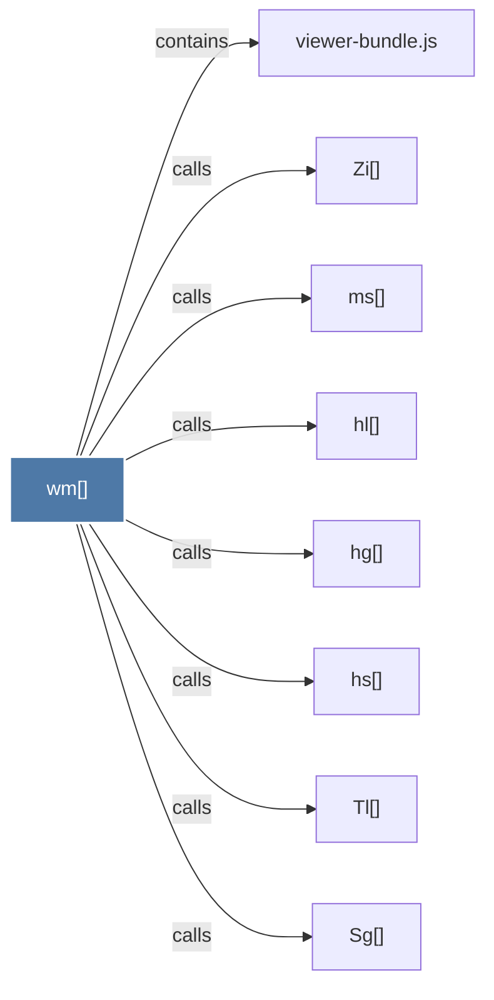

# wm()

> [!info] Properties
> **File Type**: code
> **Community**: [[_COMMUNITY_Community None|Community None]]
> **Degree**: 8

## Architecture Graph


## Outbound Connections
- [[Sg()]] - `calls` [EXTRACTED]
- [[Tl()]] - `calls` [EXTRACTED]
- [[Zi()]] - `calls` [EXTRACTED]
- [[hg()]] - `calls` [EXTRACTED]
- [[hl()]] - `calls` [EXTRACTED]
- [[hs()]] - `calls` [EXTRACTED]
- [[ms()]] - `calls` [EXTRACTED]
- [[viewer-bundle.js]] - `contains` [EXTRACTED]

## Inbound Dependencies
> [!abstract]- Files that link here
```dataview
LIST
FROM [[wm()]]
```

#graphify/code #graphify/EXTRACTED #community/Community_None