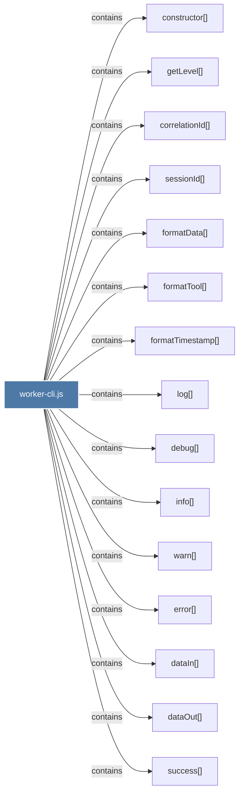

# worker-cli.js

> [!info] Properties
> **File Type**: code
> **Community**: [[_COMMUNITY_Community None|Community None]]
> **Degree**: 48

## Architecture Graph


## Outbound Connections
- [[H()]] - `contains` [EXTRACTED]
- [[N()]] - `contains` [EXTRACTED]
- [[R()]] - `contains` [EXTRACTED]
- [[W()]] - `contains` [EXTRACTED]
- [[Z()]] - `contains` [EXTRACTED]
- [[constructor()_3]] - `contains` [EXTRACTED]
- [[correlationId()]] - `contains` [EXTRACTED]
- [[dataIn()]] - `contains` [EXTRACTED]
- [[dataOut()]] - `contains` [EXTRACTED]
- [[debug()]] - `contains` [EXTRACTED]
- [[error()]] - `contains` [EXTRACTED]
- [[escapePowerShellString()]] - `contains` [EXTRACTED]
- [[failure()]] - `contains` [EXTRACTED]
- [[formatData()]] - `contains` [EXTRACTED]
- [[formatTimestamp()]] - `contains` [EXTRACTED]
- [[formatTool()_1]] - `contains` [EXTRACTED]
- [[formatUptime()_1]] - `contains` [EXTRACTED]
- [[get()]] - `contains` [EXTRACTED]
- [[getAllDefaults()]] - `contains` [EXTRACTED]
- [[getBool()]] - `contains` [EXTRACTED]
- [[getInt()]] - `contains` [EXTRACTED]
- [[getLevel()]] - `contains` [EXTRACTED]
- [[getLogFilePath()]] - `contains` [EXTRACTED]
- [[getPidInfo()]] - `contains` [EXTRACTED]
- [[getPortFromSettings()]] - `contains` [EXTRACTED]
- [[happyPathError()]] - `contains` [EXTRACTED]
- [[info()]] - `contains` [EXTRACTED]
- [[isBunAvailable()]] - `contains` [EXTRACTED]
- [[isProcessAlive()_1]] - `contains` [EXTRACTED]
- [[isRunning()]] - `contains` [EXTRACTED]
- [[loadFromFile()]] - `contains` [EXTRACTED]
- [[log()]] - `contains` [EXTRACTED]
- [[pt()]] - `contains` [EXTRACTED]
- [[removePidFile()_1]] - `contains` [EXTRACTED]
- [[restart()]] - `contains` [EXTRACTED]
- [[sessionId()]] - `contains` [EXTRACTED]
- [[start()]] - `contains` [EXTRACTED]
- [[startWithBun()]] - `contains` [EXTRACTED]
- [[status()_1]] - `contains` [EXTRACTED]
- [[stop()]] - `contains` [EXTRACTED]
- [[success()]] - `contains` [EXTRACTED]
- [[timing()]] - `contains` [EXTRACTED]
- [[tryHttpShutdown()]] - `contains` [EXTRACTED]
- [[waitForExit()_1]] - `contains` [EXTRACTED]
- [[waitForHealth()_2]] - `contains` [EXTRACTED]
- [[waitForWorkerDown()]] - `contains` [EXTRACTED]
- [[warn()]] - `contains` [EXTRACTED]
- [[writePidFile()_1]] - `contains` [EXTRACTED]

## Inbound Dependencies
> [!abstract]- Files that link here
```dataview
LIST
FROM [[worker-cli.js]]
```

#graphify/code #graphify/EXTRACTED #community/Community_None