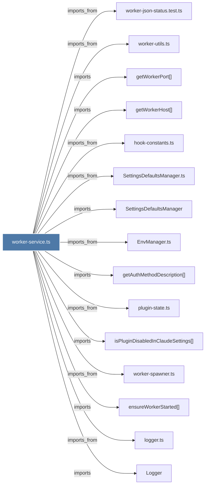

# worker-service.ts

> [!info] Properties
> **File Type**: code
> **Community**: [[_COMMUNITY_Community None|Community None]]
> **Degree**: 131

## Architecture Graph


## Outbound Connections
- [[ChromaMcpManager]] - `imports` [EXTRACTED]
- [[ChromaMcpManager.ts]] - `imports_from` [EXTRACTED]
- [[ChromaRoutes]] - `imports` [EXTRACTED]
- [[ChromaRoutes.ts]] - `imports_from` [EXTRACTED]
- [[ChromaSync]] - `imports` [EXTRACTED]
- [[ChromaSync.ts]] - `imports_from` [EXTRACTED]
- [[ClassifiedProviderError]] - `imports` [EXTRACTED]
- [[ClaudeProvider]] - `imports` [EXTRACTED]
- [[ClaudeProvider.ts]] - `imports_from` [EXTRACTED]
- [[CleanupV12_4_3.ts]] - `imports_from` [EXTRACTED]
- [[CorpusBuilder]] - `imports` [EXTRACTED]
- [[CorpusBuilder.ts]] - `imports_from` [EXTRACTED]
- [[CorpusRoutes]] - `imports` [EXTRACTED]
- [[CorpusRoutes.ts]] - `imports_from` [EXTRACTED]
- [[CorpusStore]] - `imports` [EXTRACTED]
- [[CorpusStore.ts]] - `imports_from` [EXTRACTED]
- [[CursorHooksInstaller.ts]] - `imports_from` [EXTRACTED]
- [[DataRoutes]] - `imports` [EXTRACTED]
- [[DataRoutes.ts]] - `imports_from` [EXTRACTED]
- [[DatabaseManager]] - `imports` [EXTRACTED]
- [[DatabaseManager.ts]] - `imports_from` [EXTRACTED]
- [[EnvManager.ts]] - `imports_from` [EXTRACTED]
- [[FormattingService]] - `imports` [EXTRACTED]
- [[FormattingService.ts]] - `imports_from` [EXTRACTED]
- [[GeminiCliHooksInstaller.ts]] - `imports_from` [EXTRACTED]
- [[GeminiProvider]] - `imports` [EXTRACTED]
- [[GeminiProvider.ts]] - `imports_from` [EXTRACTED]
- [[GeneratorExitHandler.ts]] - `imports_from` [EXTRACTED]
- [[GracefulShutdown.ts]] - `imports_from` [EXTRACTED]
- [[HealthMonitor.ts]] - `imports_from` [EXTRACTED]
- [[KnowledgeAgent]] - `imports` [EXTRACTED]
- [[KnowledgeAgent.ts]] - `imports_from` [EXTRACTED]
- [[Logger]] - `imports` [EXTRACTED]
- [[LogsRoutes]] - `imports` [EXTRACTED]
- [[LogsRoutes.ts]] - `imports_from` [EXTRACTED]
- [[MemoryRoutes]] - `imports` [EXTRACTED]
- [[MemoryRoutes.ts]] - `imports_from` [EXTRACTED]
- [[OpenRouterProvider]] - `imports` [EXTRACTED]
- [[OpenRouterProvider.ts]] - `imports_from` [EXTRACTED]
- [[PaginationHelper]] - `imports` [EXTRACTED]
- [[PaginationHelper.ts]] - `imports_from` [EXTRACTED]
- [[ProcessManager.ts]] - `imports_from` [EXTRACTED]
- [[SSEBroadcaster]] - `imports` [EXTRACTED]
- [[SSEBroadcaster.ts]] - `imports_from` [EXTRACTED]
- [[SearchManager]] - `imports` [EXTRACTED]
- [[SearchManager.ts]] - `imports_from` [EXTRACTED]
- [[SearchRoutes]] - `imports` [EXTRACTED]
- [[SearchRoutes.ts]] - `imports_from` [EXTRACTED]
- [[Server_1]] - `imports` [EXTRACTED]
- [[Server.ts]] - `imports_from` [EXTRACTED]
- [[SessionCompletionHandler]] - `imports` [EXTRACTED]
- [[SessionCompletionHandler.ts]] - `imports_from` [EXTRACTED]
- [[SessionEventBroadcaster]] - `imports` [EXTRACTED]
- [[SessionEventBroadcaster.ts]] - `imports_from` [EXTRACTED]
- [[SessionManager]] - `imports` [EXTRACTED]
- [[SessionManager.ts]] - `imports_from` [EXTRACTED]
- [[SessionRoutes]] - `imports` [EXTRACTED]
- [[SessionRoutes.ts]] - `imports_from` [EXTRACTED]
- [[SettingsDefaultsManager]] - `imports` [EXTRACTED]
- [[SettingsDefaultsManager.ts]] - `imports_from` [EXTRACTED]
- [[SettingsManager]] - `imports` [EXTRACTED]
- [[SettingsManager.ts]] - `imports_from` [EXTRACTED]
- [[SettingsRoutes]] - `imports` [EXTRACTED]
- [[SettingsRoutes.ts]] - `imports_from` [EXTRACTED]
- [[TimelineService]] - `imports` [EXTRACTED]
- [[TimelineService.ts]] - `imports_from` [EXTRACTED]
- [[TranscriptWatcher]] - `imports` [EXTRACTED]
- [[ViewerRoutes]] - `imports` [EXTRACTED]
- [[ViewerRoutes.ts]] - `imports_from` [EXTRACTED]
- [[WorkerService]] - `contains` [EXTRACTED]
- [[WorktreeAdoption.ts]] - `imports_from` [EXTRACTED]
- [[adoptMergedWorktrees()]] - `imports` [EXTRACTED]
- [[adoptMergedWorktreesForAllKnownRepos()]] - `imports` [EXTRACTED]
- [[attachIngestGeneratorStarter()]] - `imports` [EXTRACTED]
- [[buildStatusOutput()]] - `contains` [EXTRACTED]
- [[classifyClaudeError()]] - `imports` [EXTRACTED]
- [[classifyGeminiError()]] - `imports` [EXTRACTED]
- [[classifyOpenRouterError()]] - `imports` [EXTRACTED]
- [[cleanStalePidFile()]] - `imports` [EXTRACTED]
- [[config.ts]] - `imports_from` [EXTRACTED]
- [[configureSupervisorSignalHandlers()]] - `imports` [EXTRACTED]
- [[ensureWorkerStarted()]] - `imports` [EXTRACTED]
- [[ensureWorkerStarted()_1]] - `contains` [EXTRACTED]
- [[env-sanitizer.ts]] - `imports_from` [EXTRACTED]
- [[expandHomePath()]] - `imports` [EXTRACTED]
- [[getAuthMethodDescription()]] - `imports` [EXTRACTED]
- [[getPlatformTimeout()]] - `imports` [EXTRACTED]
- [[getSupervisor()]] - `imports` [EXTRACTED]
- [[getWorkerHost()]] - `imports` [EXTRACTED]
- [[getWorkerPort()]] - `imports` [EXTRACTED]
- [[handleCursorCommand()]] - `imports` [EXTRACTED]
- [[handleGeminiCliCommand()]] - `imports` [EXTRACTED]
- [[handleGeneratorExit()]] - `imports` [EXTRACTED]
- [[hook-constants.ts]] - `imports_from` [EXTRACTED]
- [[httpShutdown()]] - `imports` [EXTRACTED]
- [[index.ts_11]] - `imports_from` [EXTRACTED]
- [[isClassified()]] - `imports` [EXTRACTED]
- [[isGeminiAvailable()]] - `imports` [EXTRACTED]
- [[isGeminiSelected()]] - `imports` [EXTRACTED]
- [[isOpenRouterAvailable()]] - `imports` [EXTRACTED]
- [[isOpenRouterSelected()]] - `imports` [EXTRACTED]
- [[isPluginDisabledInClaudeSettings()]] - `imports` [EXTRACTED]
- [[isPortInUse()_1]] - `imports` [EXTRACTED]
- [[loadTranscriptWatchConfig()]] - `imports` [EXTRACTED]
- [[logger.ts]] - `imports_from` [EXTRACTED]
- [[main()_22]] - `contains` [EXTRACTED]
- [[performGracefulShutdown()]] - `imports` [EXTRACTED]
- [[plugin-state.ts]] - `imports_from` [EXTRACTED]
- [[provider-errors.ts]] - `imports_from` [EXTRACTED]
- [[readPidFile()]] - `imports` [EXTRACTED]
- [[removePidFile()]] - `imports` [EXTRACTED]
- [[runOneTimeChromaMigration()]] - `imports` [EXTRACTED]
- [[runOneTimeCwdRemap()]] - `imports` [EXTRACTED]
- [[runOneTimeV12_4_3Cleanup()]] - `imports` [EXTRACTED]
- [[sanitizeEnv()]] - `imports` [EXTRACTED]
- [[setIngestContext()]] - `imports` [EXTRACTED]
- [[shared.ts]] - `imports_from` [EXTRACTED]
- [[spawnDaemon()]] - `imports` [EXTRACTED]
- [[startSupervisor()]] - `imports` [EXTRACTED]
- [[touchPidFile()]] - `imports` [EXTRACTED]
- [[types.ts_1]] - `imports_from` [EXTRACTED]
- [[updateCursorContextForProject()]] - `imports` [EXTRACTED]
- [[waitForHealth()_1]] - `imports` [EXTRACTED]
- [[waitForPortFree()]] - `imports` [EXTRACTED]
- [[waitForReadiness()]] - `imports` [EXTRACTED]
- [[watcher.ts]] - `imports_from` [EXTRACTED]
- [[worker-json-status.test.ts]] - `imports_from` [EXTRACTED]
- [[worker-spawner.ts]] - `imports_from` [EXTRACTED]
- [[worker-utils.ts]] - `imports_from` [EXTRACTED]
- [[writePidFile()]] - `imports` [EXTRACTED]
- [[writeSampleConfig()]] - `imports` [EXTRACTED]

## Inbound Dependencies
> [!abstract]- Files that link here
```dataview
LIST
FROM [[worker-service.ts]]
```

#graphify/code #graphify/EXTRACTED #community/Community_None