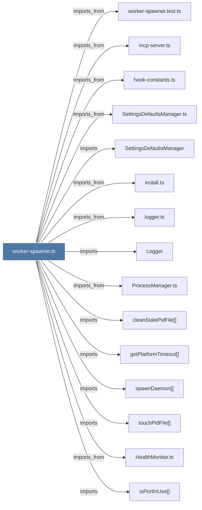

# worker-spawner.ts

> [!info] Properties
> **File Type**: code
> **Community**: [[_COMMUNITY_Community None|Community None]]
> **Degree**: 23

## Architecture Graph


## Outbound Connections
- [[HealthMonitor.ts]] - `imports_from` [EXTRACTED]
- [[Logger]] - `imports` [EXTRACTED]
- [[ProcessManager.ts]] - `imports_from` [EXTRACTED]
- [[SettingsDefaultsManager]] - `imports` [EXTRACTED]
- [[SettingsDefaultsManager.ts]] - `imports_from` [EXTRACTED]
- [[cleanStalePidFile()]] - `imports` [EXTRACTED]
- [[clearWorkerSpawnAttempted()]] - `contains` [EXTRACTED]
- [[ensureWorkerStarted()]] - `contains` [EXTRACTED]
- [[getPlatformTimeout()]] - `imports` [EXTRACTED]
- [[getWorkerSpawnLockPath()]] - `contains` [EXTRACTED]
- [[hook-constants.ts]] - `imports_from` [EXTRACTED]
- [[install.ts]] - `imports_from` [EXTRACTED]
- [[isPortInUse()_1]] - `imports` [EXTRACTED]
- [[logger.ts]] - `imports_from` [EXTRACTED]
- [[markWorkerSpawnAttempted()]] - `contains` [EXTRACTED]
- [[mcp-server.ts]] - `imports_from` [EXTRACTED]
- [[shouldSkipSpawnOnWindows()]] - `contains` [EXTRACTED]
- [[spawnDaemon()]] - `imports` [EXTRACTED]
- [[touchPidFile()]] - `imports` [EXTRACTED]
- [[waitForHealth()_1]] - `imports` [EXTRACTED]
- [[waitForReadiness()]] - `imports` [EXTRACTED]
- [[worker-service.ts]] - `imports_from` [EXTRACTED]
- [[worker-spawner.test.ts]] - `imports_from` [EXTRACTED]

## Inbound Dependencies
> [!abstract]- Files that link here
```dataview
LIST
FROM [[worker-spawner.ts]]
```

#graphify/code #graphify/EXTRACTED #community/Community_None