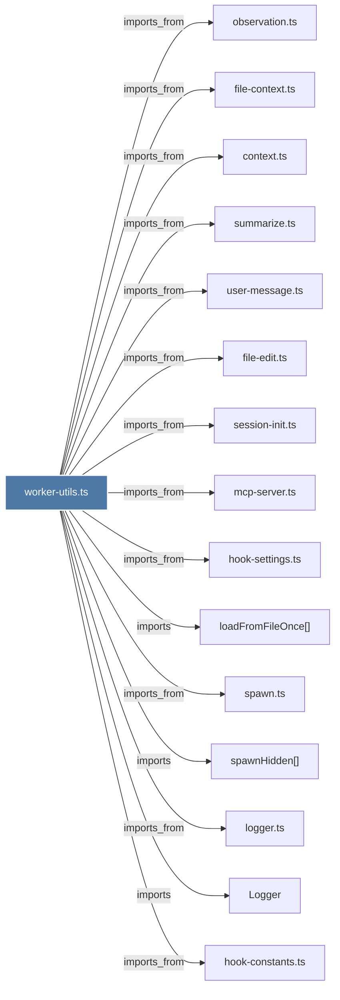

# worker-utils.ts

> [!info] Properties
> **File Type**: code
> **Community**: [[_COMMUNITY_Community None|Community None]]
> **Degree**: 55

## Architecture Graph


## Outbound Connections
- [[CursorHooksInstaller.ts]] - `imports_from` [EXTRACTED]
- [[DataRoutes.ts]] - `imports_from` [EXTRACTED]
- [[Logger]] - `imports` [EXTRACTED]
- [[OpenCodeInstaller.ts]] - `imports_from` [EXTRACTED]
- [[ResponseProcessor.ts]] - `imports_from` [EXTRACTED]
- [[SettingsDefaultsManager]] - `imports` [EXTRACTED]
- [[SettingsDefaultsManager.ts]] - `imports_from` [EXTRACTED]
- [[SettingsRoutes.ts]] - `imports_from` [EXTRACTED]
- [[WindsurfHooksInstaller.ts]] - `imports_from` [EXTRACTED]
- [[buildWorkerUrl()]] - `contains` [EXTRACTED]
- [[checkWorkerVersion()]] - `contains` [EXTRACTED]
- [[claude-md-utils.ts]] - `imports_from` [EXTRACTED]
- [[clearPortCache()]] - `contains` [EXTRACTED]
- [[context.ts]] - `imports_from` [EXTRACTED]
- [[ensureWorkerAliveOnce()]] - `contains` [EXTRACTED]
- [[ensureWorkerRunning()]] - `contains` [EXTRACTED]
- [[executeWithWorkerFallback()]] - `contains` [EXTRACTED]
- [[fetchWithTimeout()]] - `contains` [EXTRACTED]
- [[file-context.ts]] - `imports_from` [EXTRACTED]
- [[file-edit.ts]] - `imports_from` [EXTRACTED]
- [[getFailLoudThreshold()]] - `contains` [EXTRACTED]
- [[getHookFailuresPath()]] - `contains` [EXTRACTED]
- [[getPluginVersion()]] - `contains` [EXTRACTED]
- [[getStateDir()]] - `contains` [EXTRACTED]
- [[getTimeout()]] - `imports` [EXTRACTED]
- [[getWorkerHost()]] - `contains` [EXTRACTED]
- [[getWorkerPort()]] - `contains` [EXTRACTED]
- [[getWorkerVersion()]] - `contains` [EXTRACTED]
- [[hook-constants.ts]] - `imports_from` [EXTRACTED]
- [[hook-settings.ts]] - `imports_from` [EXTRACTED]
- [[index.ts_11]] - `imports_from` [EXTRACTED]
- [[isWorkerFallback()]] - `contains` [EXTRACTED]
- [[isWorkerHealthy()]] - `contains` [EXTRACTED]
- [[isWorkerPortAlive()]] - `contains` [EXTRACTED]
- [[loadFromFileOnce()]] - `imports` [EXTRACTED]
- [[logger.ts]] - `imports_from` [EXTRACTED]
- [[mcp-server.ts]] - `imports_from` [EXTRACTED]
- [[observation.ts]] - `imports_from` [EXTRACTED]
- [[paths.ts]] - `imports_from` [EXTRACTED]
- [[processor.ts]] - `imports_from` [EXTRACTED]
- [[readHookFailureState()]] - `contains` [EXTRACTED]
- [[recordWorkerUnreachable()]] - `contains` [EXTRACTED]
- [[resetWorkerFailureCounter()]] - `contains` [EXTRACTED]
- [[resolveBunRuntime()]] - `contains` [EXTRACTED]
- [[resolveWorkerScriptPath()]] - `contains` [EXTRACTED]
- [[session-init.ts]] - `imports_from` [EXTRACTED]
- [[spawn.ts]] - `imports_from` [EXTRACTED]
- [[spawnHidden()]] - `imports` [EXTRACTED]
- [[summarize.ts]] - `imports_from` [EXTRACTED]
- [[user-message.ts]] - `imports_from` [EXTRACTED]
- [[validateWorkerPidFile()]] - `imports` [EXTRACTED]
- [[waitForWorkerPort()]] - `contains` [EXTRACTED]
- [[worker-service.ts]] - `imports_from` [EXTRACTED]
- [[workerHttpRequest()]] - `contains` [EXTRACTED]
- [[writeHookFailureStateAtomic()]] - `contains` [EXTRACTED]

## Inbound Dependencies
> [!abstract]- Files that link here
```dataview
LIST
FROM [[worker-utils.ts]]
```

#graphify/code #graphify/EXTRACTED #community/Community_None