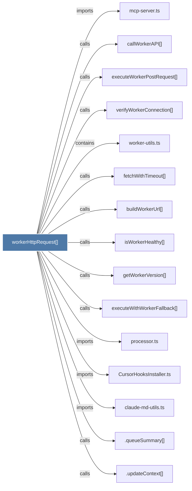

# workerHttpRequest()

> [!info] Properties
> **File Type**: code
> **Community**: [[_COMMUNITY_Community None|Community None]]
> **Degree**: 18

## Architecture Graph


## Outbound Connections
- [[.queueSummary()]] - `calls` [INFERRED]
- [[.updateContext()]] - `calls` [INFERRED]
- [[CursorHooksInstaller.ts]] - `imports` [EXTRACTED]
- [[buildWorkerUrl()]] - `calls` [EXTRACTED]
- [[callWorkerAPI()]] - `calls` [INFERRED]
- [[claude-md-utils.ts]] - `imports` [EXTRACTED]
- [[executeWithWorkerFallback()]] - `calls` [EXTRACTED]
- [[executeWorkerPostRequest()]] - `calls` [INFERRED]
- [[fetchInitialContextFromWorker()]] - `calls` [INFERRED]
- [[fetchWithTimeout()]] - `calls` [EXTRACTED]
- [[getWorkerVersion()]] - `calls` [EXTRACTED]
- [[isWorkerHealthy()]] - `calls` [EXTRACTED]
- [[mcp-server.ts]] - `imports` [EXTRACTED]
- [[processor.ts]] - `imports` [EXTRACTED]
- [[updateCursorContextForProject()]] - `calls` [INFERRED]
- [[updateFolderClaudeMdFiles()]] - `calls` [INFERRED]
- [[verifyWorkerConnection()]] - `calls` [INFERRED]
- [[worker-utils.ts]] - `contains` [EXTRACTED]

## Inbound Dependencies
> [!abstract]- Files that link here
```dataview
LIST
FROM [[workerHttpRequest()]]
```

#graphify/code #graphify/EXTRACTED #community/Community_None