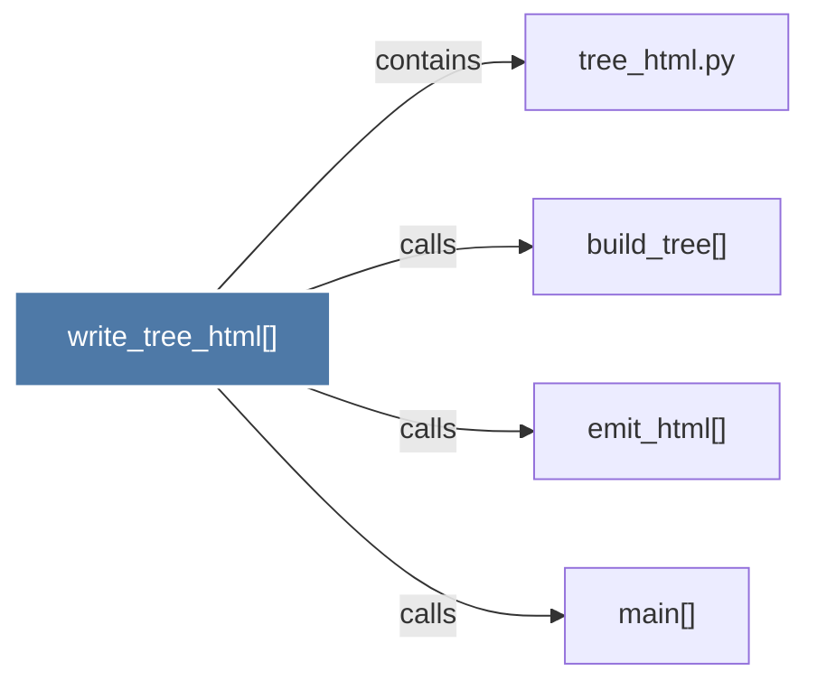

# write_tree_html()

> [!info] Properties
> **File Type**: code
> **Community**: [[_COMMUNITY_Community None|Community None]]
> **Degree**: 4

## Architecture Graph


## Outbound Connections
- [[build_tree()]] - `calls` [EXTRACTED]
- [[emit_html()]] - `calls` [EXTRACTED]
- [[main()_2]] - `calls` [INFERRED]
- [[tree_html.py]] - `contains` [EXTRACTED]

## Inbound Dependencies
> [!abstract]- Files that link here
```dataview
LIST
FROM [[write_tree_html()]]
```

#graphify/code #graphify/EXTRACTED #community/Community_None