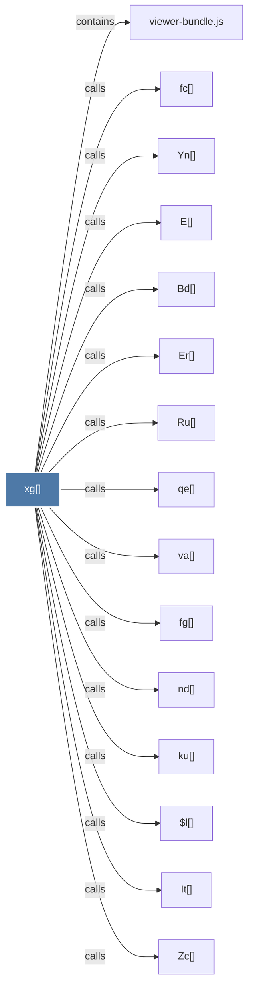

# xg()

> [!info] Properties
> **File Type**: code
> **Community**: [[_COMMUNITY_Community None|Community None]]
> **Degree**: 32

## Architecture Graph


## Outbound Connections
- [[$l()]] - `calls` [EXTRACTED]
- [[$t()]] - `calls` [EXTRACTED]
- [[Bd()]] - `calls` [EXTRACTED]
- [[C0()]] - `calls` [EXTRACTED]
- [[Dd()]] - `calls` [EXTRACTED]
- [[E()]] - `calls` [EXTRACTED]
- [[Er()]] - `calls` [EXTRACTED]
- [[It()]] - `calls` [EXTRACTED]
- [[Ma()]] - `calls` [EXTRACTED]
- [[Ru()]] - `calls` [EXTRACTED]
- [[Yn()]] - `calls` [EXTRACTED]
- [[Zc()]] - `calls` [EXTRACTED]
- [[_i()]] - `calls` [EXTRACTED]
- [[at()]] - `calls` [EXTRACTED]
- [[cy()]] - `calls` [EXTRACTED]
- [[ee()]] - `calls` [EXTRACTED]
- [[fc()]] - `calls` [EXTRACTED]
- [[fg()]] - `calls` [EXTRACTED]
- [[id()]] - `calls` [EXTRACTED]
- [[iy()]] - `calls` [EXTRACTED]
- [[jl()]] - `calls` [EXTRACTED]
- [[ku()]] - `calls` [EXTRACTED]
- [[n0()]] - `calls` [EXTRACTED]
- [[nd()]] - `calls` [EXTRACTED]
- [[nt()]] - `calls` [EXTRACTED]
- [[od()]] - `calls` [EXTRACTED]
- [[pr()]] - `calls` [EXTRACTED]
- [[qe()]] - `calls` [EXTRACTED]
- [[sd()]] - `calls` [EXTRACTED]
- [[va()]] - `calls` [EXTRACTED]
- [[viewer-bundle.js]] - `contains` [EXTRACTED]
- [[zg()]] - `calls` [EXTRACTED]

## Inbound Dependencies
> [!abstract]- Files that link here
```dataview
LIST
FROM [[xg()]]
```

#graphify/code #graphify/EXTRACTED #community/Community_None