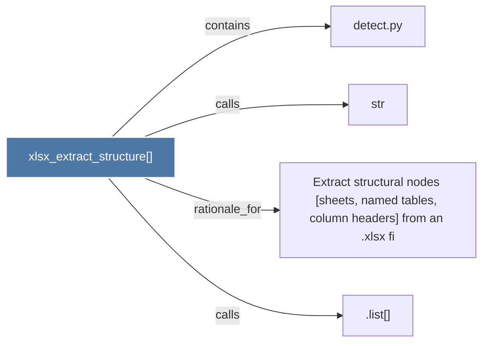

# xlsx_extract_structure()

> [!info] Properties
> **File Type**: code
> **Community**: [[_COMMUNITY_Community None|Community None]]
> **Degree**: 4

## Architecture Graph


## Outbound Connections
- [[.list()]] - `calls` [INFERRED]
- [[Extract structural nodes (sheets, named tables, column headers) from an .xlsx fi]] - `rationale_for` [EXTRACTED]
- [[detect.py]] - `contains` [EXTRACTED]
- [[str]] - `calls` [EXTRACTED]

## Inbound Dependencies
> [!abstract]- Files that link here
```dataview
LIST
FROM [[xlsx_extract_structure()]]
```

#graphify/code #graphify/EXTRACTED #community/Community_None