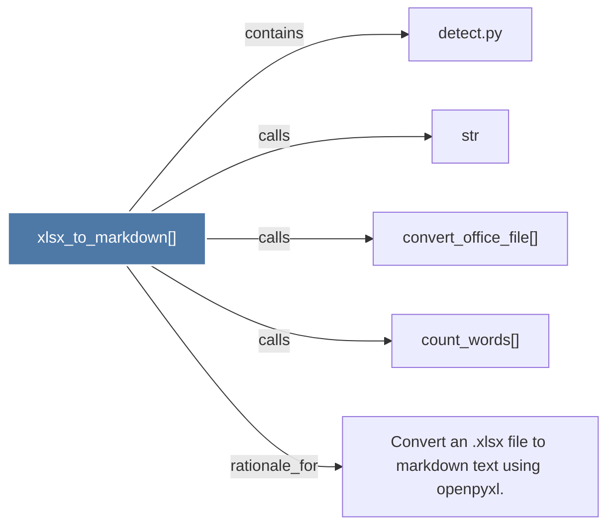

# xlsx_to_markdown()

> [!info] Properties
> **File Type**: code
> **Community**: [[_COMMUNITY_Community None|Community None]]
> **Degree**: 5

## Architecture Graph


## Outbound Connections
- [[Convert an .xlsx file to markdown text using openpyxl.]] - `rationale_for` [EXTRACTED]
- [[convert_office_file()]] - `calls` [EXTRACTED]
- [[count_words()]] - `calls` [EXTRACTED]
- [[detect.py]] - `contains` [EXTRACTED]
- [[str]] - `calls` [EXTRACTED]

## Inbound Dependencies
> [!abstract]- Files that link here
```dataview
LIST
FROM [[xlsx_to_markdown()]]
```

#graphify/code #graphify/EXTRACTED #community/Community_None