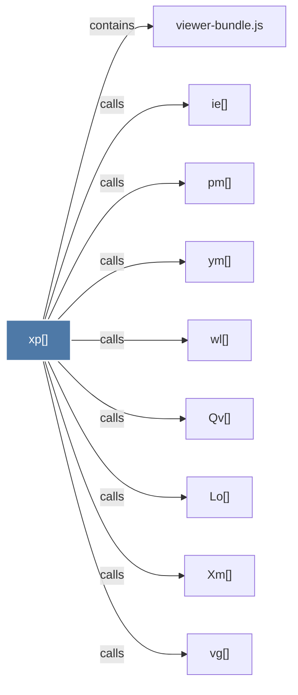

# xp()

> [!info] Properties
> **File Type**: code
> **Community**: [[_COMMUNITY_Community None|Community None]]
> **Degree**: 9

## Architecture Graph


## Outbound Connections
- [[Lo()]] - `calls` [EXTRACTED]
- [[Qv()]] - `calls` [EXTRACTED]
- [[Xm()]] - `calls` [EXTRACTED]
- [[ie()]] - `calls` [EXTRACTED]
- [[pm()]] - `calls` [EXTRACTED]
- [[vg()]] - `calls` [EXTRACTED]
- [[viewer-bundle.js]] - `contains` [EXTRACTED]
- [[wl()]] - `calls` [EXTRACTED]
- [[ym()]] - `calls` [EXTRACTED]

## Inbound Dependencies
> [!abstract]- Files that link here
```dataview
LIST
FROM [[xp()]]
```

#graphify/code #graphify/EXTRACTED #community/Community_None