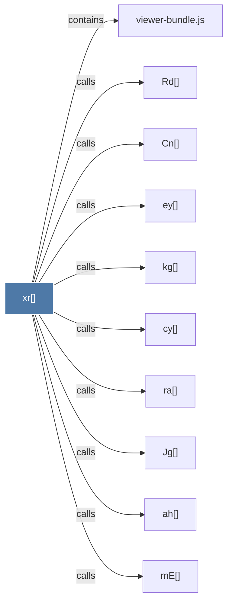

# xr()

> [!info] Properties
> **File Type**: code
> **Community**: [[_COMMUNITY_Community None|Community None]]
> **Degree**: 10

## Architecture Graph


## Outbound Connections
- [[Cn()]] - `calls` [EXTRACTED]
- [[Jg()]] - `calls` [EXTRACTED]
- [[Rd()]] - `calls` [EXTRACTED]
- [[ah()]] - `calls` [EXTRACTED]
- [[cy()]] - `calls` [EXTRACTED]
- [[ey()]] - `calls` [EXTRACTED]
- [[kg()]] - `calls` [EXTRACTED]
- [[mE()]] - `calls` [EXTRACTED]
- [[ra()]] - `calls` [EXTRACTED]
- [[viewer-bundle.js]] - `contains` [EXTRACTED]

## Inbound Dependencies
> [!abstract]- Files that link here
```dataview
LIST
FROM [[xr()]]
```

#graphify/code #graphify/EXTRACTED #community/Community_None