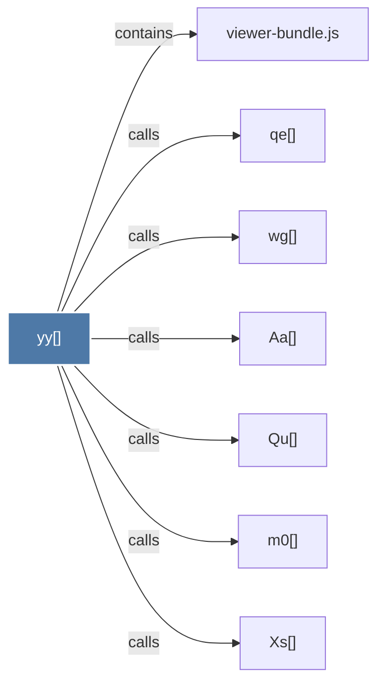

# yy()

> [!info] Properties
> **File Type**: code
> **Community**: [[_COMMUNITY_Community None|Community None]]
> **Degree**: 7

## Architecture Graph


## Outbound Connections
- [[Aa()]] - `calls` [EXTRACTED]
- [[Qu()]] - `calls` [EXTRACTED]
- [[Xs()]] - `calls` [EXTRACTED]
- [[m0()]] - `calls` [EXTRACTED]
- [[qe()]] - `calls` [EXTRACTED]
- [[viewer-bundle.js]] - `contains` [EXTRACTED]
- [[wg()]] - `calls` [EXTRACTED]

## Inbound Dependencies
> [!abstract]- Files that link here
```dataview
LIST
FROM [[yy()]]
```

#graphify/code #graphify/EXTRACTED #community/Community_None