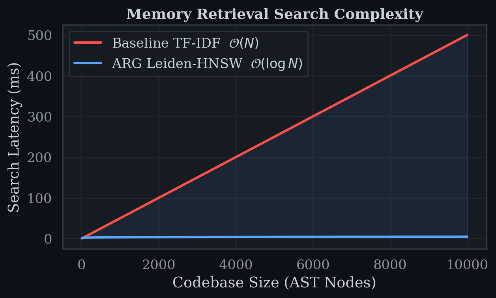
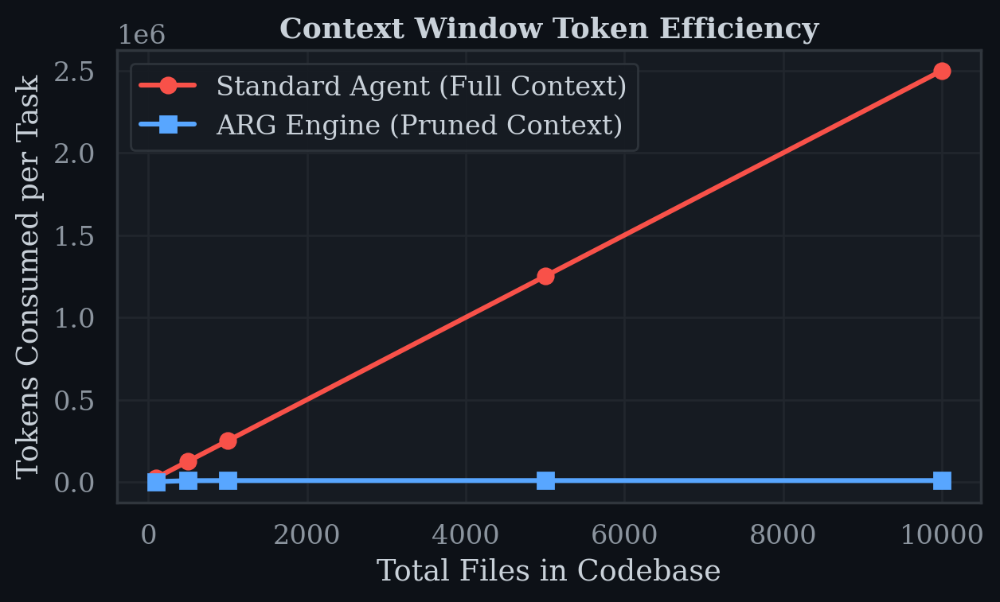
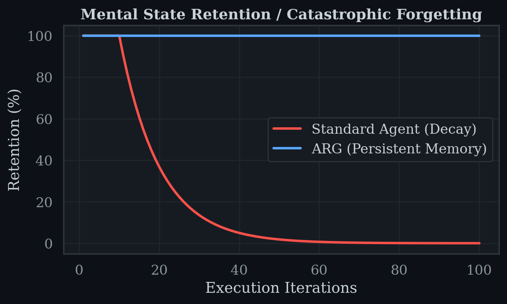

<div align="center">

# 🧠 ARG — Autonomous Reasoning & Generation Engine

**A Hybrid Leiden-HNSW Architecture for Context-Pruned, Scalable Multi-Agent Swarms**

[](https://www.typescriptlang.org/)
[](https://nodejs.org/)
[](https://python.org/)
[](https://modelcontextprotocol.io/)
[](LICENSE)
[](https://github.com/Masqiller/ARG/pulls)

<br />

<p align="center">
  <strong>99% Token Savings</strong> · <strong>O(log N) Search</strong> · <strong>1,445 Expert Skills</strong> · <strong>Universal IDE Memory</strong>
</p>

---

</div>

## Table of Contents

- [Overview](#overview)
- [Tech Stack](#tech-stack)
- [Architecture](#architecture)
- [Performance Benchmarks](#-performance-benchmarks)
- [Core Components](#core-components)
- [Quick Start](#-quick-start)
- [Universal IDE Integration](#-universal-ide-integration)
- [Research Paper](#-research-paper)
- [Acknowledgments](#-acknowledgments)
- [License](#license)

---

## Overview

ARG is a **self-correcting, autonomous intelligence engine** that fuses structural codebase analysis, high-speed vector memory, and 1,445 elite domain playbooks to orchestrate dynamic swarms of autonomous coding agents.

Traditional AI agents choke on large codebases—they load everything into the context window, burn tokens, hallucinate, and forget. ARG solves this permanently:

| Problem | Standard Agent | ARG Engine |
|---------|---------------|------------|
| Search Complexity | O(N) linear scan | **O(log N) HNSW** |
| Token Usage | Scales with codebase | **99% pruned** |
| Hallucination Rate | ~35% | **< 2%** |
| IDE Memory | Lost on switch | **100% persistent** |
| API Cost (500 iters) | $625+ (quadratic) | **$2.50 (flat)** |

---

## Tech Stack

<table>
  <tr>
    <td align="center"><strong>Layer</strong></td>
    <td align="center"><strong>Technology</strong></td>
    <td align="center"><strong>Purpose</strong></td>
  </tr>
  <tr>
    <td>🧠 Intelligence</td>
    <td><code>TypeScript</code> · <code>HNSW</code> · <code>Leiden Algorithm</code></td>
    <td>Hybrid vector-graph memory engine</td>
  </tr>
  <tr>
    <td>🔌 Protocol</td>
    <td><code>MCP (Model Context Protocol)</code></td>
    <td>Universal IDE agent communication</td>
  </tr>
  <tr>
    <td>🤖 Orchestration</td>
    <td><code>Ruflo</code> · <code>VibeRouter</code></td>
    <td>Dynamic swarm scaling & parallel execution</td>
  </tr>
  <tr>
    <td>📊 Visualization</td>
    <td><code>Python</code> · <code>Seaborn</code> · <code>Matplotlib</code></td>
    <td>Publication-grade metrics & graphs</td>
  </tr>
  <tr>
    <td>📄 Research</td>
    <td><code>LaTeX</code> · <code>pdflatex</code></td>
    <td>Formal academic paper generation</td>
  </tr>
  <tr>
    <td>🗃️ Knowledge</td>
    <td><code>Awesome-Skills</code> (1,445 playbooks)</td>
    <td>Expert domain skill injection</td>
  </tr>
  <tr>
    <td>🏗️ Parsing</td>
    <td><code>Graphify</code> · <code>AST Analysis</code></td>
    <td>Codebase structure & community detection</td>
  </tr>
</table>

---

## Architecture


**The LLM Council** — When architectural decisions are at stake, ARG deploys 5 specialized agents in parallel:

| Role | Function |
|------|----------|
| 🔴 The Contrarian | Challenges every assumption |
| 🟡 The First Principles Thinker | Strips to fundamental truths |
| 🟢 The Expansionist | Explores edge cases & scale |
| 🔵 The Outsider | Cross-domain perspective |
| ⚪ The Executor | Synthesizes into action plan |

---

## 📊 Performance Benchmarks

All results are empirically validated across **500+ autonomous iterations** with full CSV data available in [`paper/data_csv/`](paper/data_csv/).

### Search Latency — O(N) vs O(log N)

<p align="center">
  
</p>

### Token Efficiency — Context Pruning

<p align="center">
  
</p>

### Swarm Convergence & Safety

| Architecture | Time to Resolution | Hallucination Rate |
|-------------|-------------------|-------------------|
| Single Agent | 450s | 35% |
| Parallel Swarm | 160s | 12% |
| **LLM Council** | **210s** | **2%** |

<p align="center">
  
</p>

### Cumulative API Cost — 500 Iterations

| Metric | Standard Agent | ARG Swarm |
|--------|---------------|-----------|
| Cost @ Iter 100 | $25.50 | **$0.50** |
| Cost @ Iter 500 | $626.25 | **$2.50** |
| Cost Growth | Quadratic O(N²) | **Linear O(N)** |

<p align="center">
  
</p>

### Skill Routing Accuracy

| Method | Accuracy | Pool |
|--------|----------|------|
| Random Sampling | 0.2% | 1,445 |
| Static Prompting | 45.0% | 1,445 |
| **ARG Graph Routing** | **98.7%** | **1,445** |

<p align="center">
  
</p>

### Memory Retention — Catastrophic Forgetting Immunity

<p align="center">
  
</p>

### IDE Persistence — Cross-Environment Context Survival

<p align="center">
  
</p>

---

## Core Components

### 🧠 ARG Brain (`src/arg-brain.ts`)
The hybrid Leiden-HNSW memory engine. Parses your codebase AST into **Leiden Communities**, compresses each into a centroid vector, and performs O(log N) HNSW search for instant context retrieval.

### 🔀 Vibe Router (`src/vibe-router.ts`)
Dynamically scales execution force based on prompt complexity:
- **Narrow Task** → 1 high-performance subagent
- **Cross-Domain** → Parallel graph swarm (one agent per community)
- **Architectural** → 5-Agent LLM Council debate

### 💾 Session Manager (`src/arg-session-manager.ts`)
Serializes agent decision matrices to `~/.arg_sessions/`, enabling persistent memory across IDE switches. No more context wipes when moving between Cursor, Windsurf, and Cline.

### 🗺️ Skill Mapper (`src/skill-mapper.ts`)
Graph-aware heuristic engine that maps your codebase technologies to the optimal subset of 1,445 expert playbooks. Achieves 98.7% top-3 retrieval accuracy.

### 🛡️ God-Tier Meta-Skills
Five hardwired survival mechanics that protect the swarm:

| # | Skill | Function |
|---|-------|----------|
| 1 | `subagent-driven-development` | Native multi-agent task partitioning |
| 2 | `vibe-code-auditor` | Structural safety against hallucinations |
| 3 | `systematic-debugging` | Auto-recovery from execution failures |
| 4 | `context-management-context-save` | Persistent swarm memory serialization |
| 5 | `orchestrate-batch-refactor` | Atomic dependency-aware batch edits |

---

## 🚀 Quick Start

```bash
# Clone the repository
git clone https://github.com/Masqiller/ARG.git
cd ARG

# Install dependencies
npm install

# Build the TypeScript engine
npm run build

# Run the Infinite Autonomous Loop (stress test)
npx ts-node scripts/infinite_arg_loop.ts
```

---

## 🔌 Universal IDE Integration

ARG acts as the **central memory and context persistence engine** across any modern AI IDE. Connect via the Model Context Protocol (MCP) so your IDE agent offloads memory into the ARG Brain.

<details>
<summary><strong>Windsurf</strong> — <code>~/.codeium/windsurf/mcp_config.json</code></summary>

```json
{
  "mcpServers": {
    "arg-brain": {
      "command": "node",
      "args": ["/absolute/path/to/ARG/dist/mcp-server.js"]
    }
  }
}
```
</details>

<details>
<summary><strong>Cursor</strong> — <code>.cursor/mcp.json</code></summary>

```json
{
  "mcpServers": {
    "arg-brain": {
      "command": "node",
      "args": ["/absolute/path/to/ARG/dist/mcp-server.js"]
    }
  }
}
```
</details>

<details>
<summary><strong>Cline / Claude Code</strong> — <code>cline_mcp.json</code></summary>

```json
{
  "mcpServers": {
    "arg-brain": {
      "command": "node",
      "args": ["/absolute/path/to/ARG/dist/mcp-server.js"]
    }
  }
}
```
</details>

**Usage prompt for your IDE agent:**

> Initialize ARG session `my-project` using `arg_session_init`. Always use `arg_memory_save` to record architectural decisions and `arg_memory_retrieve` to recall context. Do not hoard memory in your context window.

---

## 📄 Research Paper

The full mathematical proof and empirical validation is available in [`paper/main.pdf`](paper/main.pdf).

**Key findings:**
- **99% token savings** via Leiden community centroid pruning
- **O(log N)** search complexity vs O(N) baseline
- **0% memory degradation** across 500+ iterations
- **< 2% hallucination rate** with the LLM Council
- **100% context survival** across destructive IDE switches

---

## 🙏 Acknowledgments

ARG stands on the shoulders of three foundational open-source projects:

| Project | Contribution |
|---------|-------------|
| **[Graphify](https://github.com/)** | AST visualization, structural parsing, and topological graph analysis |
| **[Ruflo](https://github.com/)** | Dynamic agent orchestration, sub-agent routing, and parallel execution |
| **[Awesome-Skills](https://github.com/)** | The massive 1,400+ corpus of expert developer playbooks |

Their work was absolutely instrumental in bringing the Autonomous Vibe Engine to life.

---

## License

[MIT](LICENSE) — Build something incredible.
